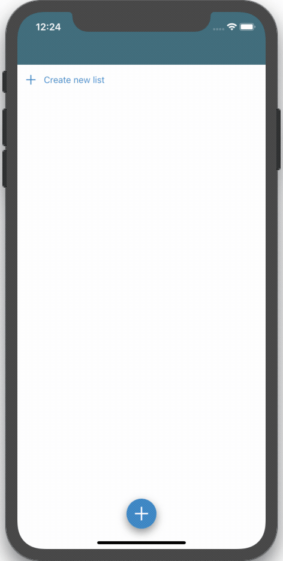
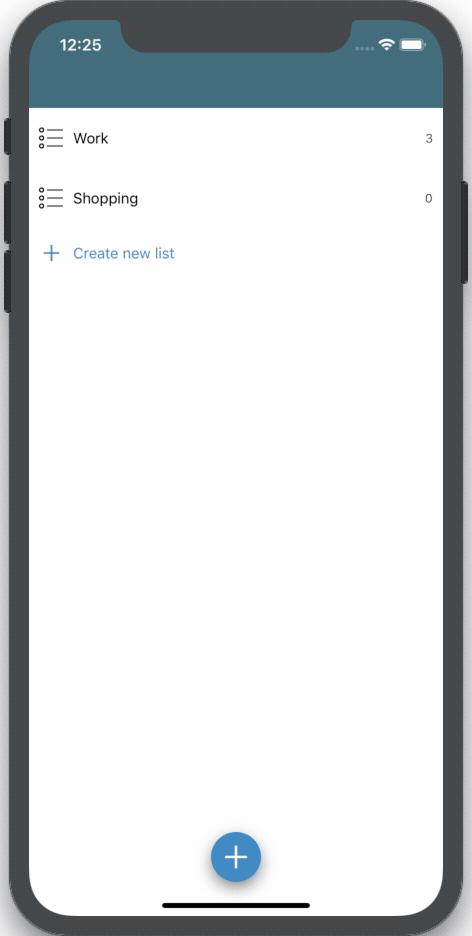

# ToDo
Simple task manager app for iOS. 

### Demo 

### Key Implementation Details  
  - UICollectionView, UITableView
  - Realm 
  - Notifcations 
 
 ### Future features  
**Currently being worked on**
  - Sort toDo's by date created, due date, completion status, custom 
  - Recieve reminders / notifications when toDo is due 
  - Custom themes 
  - Ability to add subtasks, notes, and files within a toDo 
  - Ability to quick add toDos from start page
  - Ability to delete multiple toDo's at once 
  
### Installation 

Install Cocoa Pods if not already installed.

`sudo gem install cocoapods`

Install necessary pods by running command in project folder. 

`pod install`

Open ToDo.xcworkspace in XCode and run

Project is currently updated for Swift 5. 
